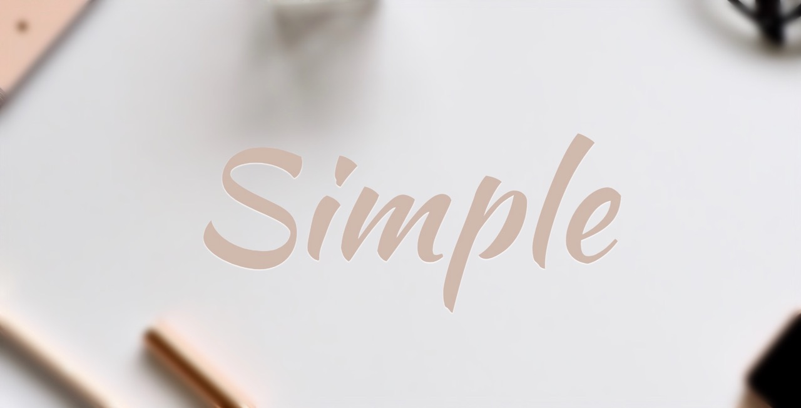
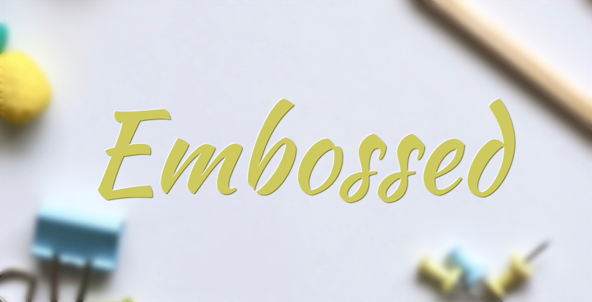
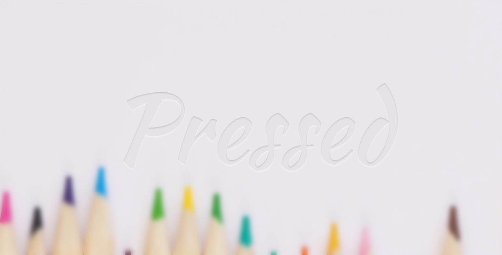
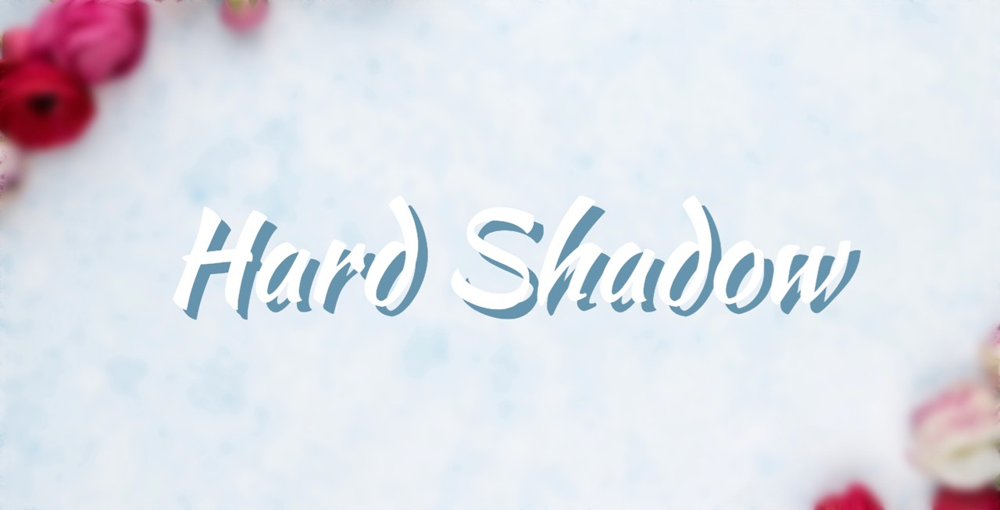

# Fun With Text-shadows

Here is my take on creating text effects using the `text-shadow` property.

1. Simple Letterpress



```css
    text-shadow: 0 1px 1px #fff;
```

2. Embossed Effect



```css
    text-shadow: text-shadow: -1px -1px 1px #fff, 1px 1px 1px #5d5c1d;
```

3. Glowing Effect


```css
    text-shadow: 0 0 5px #fff, 0 0 10px #fff, 0 0 15px #fff, 0 0 20px #ff1493, 0 0 25px #8a2be2;
```

4. Blured Effect


```css
    text-shadow: 0 0 5px rgba(255, 255, 255, 0.6), 0 0 10px rgba(255, 255, 255, 0.4), 0 0 15px rgba(255, 255, 255, 0.3);
```

5. Pressed Effect



```css
    text-shadow: 0px 2px 2px rgba(255, 255, 255, 0.5);

    background: #ccc6cc;
    color: transparent;
    -webkit-background-clip: text;
    -moz-background-clip: text;
    background-clip: text;
```

**Note**: `text-shadow` alone won't be able to accomplish this effect. You need to set the font `color` to `transparent`, the `background` to a darker shade if not the same as the parent's background color or image, and use `background-clip: text;` to create the *pressed* finish.

6. Classic Hard Shadow



```css
    text-shadow: 10px 10px 0 #6695ac;
```

This collection doesn't limit what the `text-shadow` property can do. All it takes is creativity.

Some inspirations I got are from [here](https://mayvendev.com/blog/inner-shadows-in-css-images-text-and-beyond) and [here](https://www.midwinter-dg.com/blog_demos/css-text-shadows/).